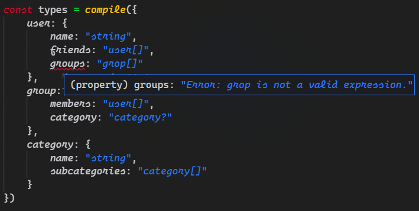

# Taking TypeScript too far: Can types parse their own syntax?


Now, I know you might be thinking "Oh look, another developer using TypeScript types to achieve something completely impractical just to prove it's possible."

And you're (half) right.

Using generic types and template strings to parse types from their definitions _is_ completely impractical. But- and you'll have to hear me out on this- it may not be completely useless.

Have you ever spent hours meticulously defining TypeScript types just for them to be compiled away when you need them to validate your data at runtime? Whether you're parsing a text file, handling an API request or checking a form submission, all of a sudden the definitions you worked so hard on are completely useless.

So now, instead of extending your existing definitions for validation, you're stuck translating the entire structure to whatever format your validator (Zod, Yup, JOI, etc.) understands, duplicating code that is:

-   Likely to require frequent updates
-   Normally not necessary to test
-   Relied on as a single source of truth

There have been attempts to mitigate this. Zod in particular has made type infererence a core focus of their approach, but even they claim that:

> "Because of a limitation of TypeScript, types from recursive schemas can't be statically inferred."

So once again, we find ourselves having to duplicate our types, as well as to translate them into a rather unwieldy construct like this one from their documentation:

> ```ts
> interface Category {
>     name: string
>     subcategories: Category[]
> }
>
> // cast to z.ZodType<Category>
> const Category: z.ZodType<Category> = z.lazy(() =>
>     z.object({
>         name: z.string(),
>         subcategories: z.array(Category)
>     })
> )
> ```

To me, this schema definition feels a little yucky, especially compared to the original TypeScript. All of this begs the question: how close can we get to TypeScript syntax within the confines of JavaScript?

The answer probably looks something like this:

```ts
const category = {
    name: "string",
    subcategories: "category[]"
}
```

This looks a lot more natural, but to use it, we'll need to be able to:

1. Write some function(s) to parse JS objects and strings to validate data at runtime
2. Write some generic types(s) to convert a definition to the type it represents

`1` is definitely achievable; with just a few `typeof` comparisons and some RegEx, we're off to the recursive races. But what about `2`? What really _are_ the limitations of TypeScript?

## Starting small

When I'm trying to wrap my head around a tough problem, I like to start by answering the question "what does the simplest version of this look like?"

In this case, the simplest definition from which we could infer a type is a keyword like `"string"` or `"number"`. Luckily, [Generics](https://www.typescriptlang.org/docs/handbook/2/generics.html) actually make this fairly straight forward for us. You've probably seen generics like `Array<string>` or `Partial<Options>`, but they're remarkably flexible. I find it helpful to think of them as functions that take one or more types as input and return a new one.

```ts
// Map keywords to their corresponding types
type BuiltinKeywords = {
    string: string
    number: number
    boolean: boolean
    null: null
    any: any
    // etc...
}

/**
 * In: One of the string keys from the map we defined
 * Out: The corresponding type
 **/
type TypeOfKeyword<Keyword extends keyof KeywordsToTypes> =
    KeywordsToTypes[Keyword]

// Typed as string
type Result = TypeOfKeyword<"string">
```

This is all well and good for primitives, but to call this "parsing" is a stretch. TypeScript's real power lies in the flexibility to define types using arbitrarily composable expressions like lists (`A[]`) and unions (`A|B`), as well as modifiers like (`{key?: value}`) to make a key optional.

Is there any hope for an endeavoring type enthusiast hoping to extract a meaningful type from a definition like `string|number[]?`?

## Expressing yourself

Enter [Conditional](https://www.typescriptlang.org/docs/handbook/2/conditional-types.html) and [Template Literal](https://www.typescriptlang.org/docs/handbook/2/template-literal-types.html) types. If you've never seen them before, don't worry- they're just ternaries (`condition ? valueIfTrue : valueIfFalse`) and template strings (`` `Hello, ${name}.` ``) for types. Together, they're just what we need to take ourselves to the next level of type-ception.

<!-- prettier-ignore -->
```ts
type TypeOfExpression<Expression extends string> =
    // If the expression ends with "?"...
    Expression extends `${infer Optional}?`
    // Recurse to infer the type of the inner expression and add undefined as a valid type.
    ? TypeOfExpression<Optional> | undefined
    // If the expression includes "|"...
    : Expression extends `${infer Left}|${infer Right}`
    // Recurse to infer the type of each half (either is valid).
    ? TypeOfExpression<Left> | TypeOfExpression<Right>
    // If the expression ends in "[]"...
    : Expression extends `${infer Item}[]`
    // Recurse to infer the type of the inner expression and convert it to a list.
    ? TypeOfExpression<Item>[]
    // If the expression is just a keyword...
    : Expression extends keyof KeywordsToTypes
    // Use our first generic to infer its type.
    ? TypeOfKeyword<Expression>
    // Else, the expression is not something we've defined yet so infer unknown
    : unknown

// Typed as string | number[] | undefined
type Result = TypeOfExpression<`string|number[]?`>
```

Note: If `undefined` is not included in `Result`, you need to set "strict" or "strictNullChecks" to true in your [tsconfig](https://www.typescriptlang.org/docs/handbook/tsconfig-json.html).

It's important to consider the order in which these extends checks are performed. For example, if we had checked whether our expression matches `${infer Item}[]` before `${Left}|${Right}`, the result would have been `(string | number)[] | undefined`, which would be inconsistent with TypeScript in which unions have precedence over lists.

At this point, we also might want to think more about what happens when the definition is invalid; it's easy to make a mistake when you're typing an expression in a string. Luckily, we can adapt the model we've created in `TypeOfExpression` for a new generic that will give us helpful type hints if anything goes awry:

<!-- prettier-ignore -->
```ts
/**
 * In:
 *    Fragment: The part of the expression we are currently validating
 *    Root: The entire original expression
 * Out:
 *    If the Fragment (and all nested Fragments) is valid:
 *        Return Root (the original expression).
 *    If the Fragment (or a nested Fragment) is invalid:
 *        Return a string describing the part of the Fragment that was invalid.
 **/
type ValidateFragment<Fragment extends string, Root extends string> = 
    // If the expression ends with "?"...
    Fragment extends `${infer Optional}?`
    // Recurse to validate the inner expression.
    ? ValidateFragment<Optional, Root>
    // If the expression includes "|"...
    : Fragment extends `${infer Left}|${infer Right}`
    // Recurse to validate the first half. If the result is valid...
    ? ValidateFragment<Left, Root> extends Root
        // Recurse to validate the second half and return the result.
        ? ValidateFragment<Right, Root>
        // Else return the error from the first half.
        : ValidateFragment<Left, Root>
    // If the expression ends with "[]"...
    : Fragment extends `${infer Item}[]`
    // Recurse to validate the inner expression.
    ? ValidateFragment<Item, Root>
    // If the expression is just a keyword...
    : Fragment extends keyof KeywordsToTypes
    // It is valid, so return Root (the original expression).
    ? Root
    // Else, the expression doesn't match anything we've defined, so return an error message.
    : `Error: '${Fragment}' is not a valid expression.`

// Helper type to avoid having to pass the entire expression to ValidateFragment twice
type ValidateExpression<Expression extends string> = ValidateFragment<
    Expression,
    Expression
>
```

By returning the original input when its valid, we can use `ValidateExpression` directly to provide type hints for a `parse` function that takes an expression and uses `TypeOfExpression` to infer its type:

```ts
const parseExpression = <Expression extends string>(
    // TypeScript will infer the "Expression" type from the value of the "expression" parameter
    expression: ValidateExpression<Expression>
): TypeOfExpression<Expression> => {
    // The actual return value is irrelevant (for now) since we're just using it to infer a type
    return null as any
}

// No type errors
// goodType inferred as string | number[] | undefined
const goodType = parseExpression("string|number[]?")

// Argument of type '"string|numbr[]?"' is not assignable to parameter of type '"Error: numbr is not a valid expression."'
// badType inferred as unknown
const badType = parseExpression("string|numbr[]?")
```

We could expand this proof of concept to handle intersections, literals, arrow functions, and more! For a TypeScript nerd like me, that's all really exciting from a theoretical perspective. Practically, though, expressions will only take us so far in isolation. Most types worth defining have a little more structure than a even a well-validated string can accomodate (at least without making most devs want to tear their eyes out). Might there be a more bearable approach for dealing with objects?

## Taking shape

Suppose we have the following `user` type:

```ts
type User = {
    name: {
        first: string
        middle?: string
        last: string
    }
    emails: string[] | null
    coords: [number, number]
}
```

At runtime, we might care about other things like whether email addresses are properly formatted. We'll get to that, but let's make sure we can support TypeScript's built-in types before we try to extend them.

In the meantime, we can convert a structured definition to a type by incorporating another one of TypeScript's most powerful features- [Mapped](https://www.typescriptlang.org/docs/handbook/2/mapped-types.html) types.

<!-- prettier-ignore -->
```ts
type TypeOfV1<Def> = 
    // If Def is an object...
    Def extends object
    ? {
          // For each Key in Def, recurse to infer the type of its value.
          [Key in keyof Def]: TypeOfV1<Def[Key]>
      }
    // If Def is a string...
    : Def extends string
    // Use our last generic to infer its type.
    ? TypeOfExpression<Def>
    // Else, the value is not something we've defined yet so infer unknown   
    : unknown
```

Simple enough, and the results look perfect... almost. Unfortunately, in this case, the devil's in the details. Take a look at the type we infer:

```ts
const Def = {
    name: {
        first: "string",
        middle: "string?",
        last: "string"
    },
    emails: "string[]|null",
    coords: ["number", "number"]
}

type InferredType = {
    name: {
        first: string
        // Undefined is added a possible value, but the key is still required
        middle: string | undefined
        last: string
    }
    emails: string[] | null
    coords: [number, number]
}
```

This is where we start to encounter some of the... quirks... of using generic types to solve the kinds of problems that would be trivial if we had access to normal imperative programming constructs, but alas, we press on.

This next snippet is the most complex we'll cover in this article, but not necessarily required reading if you'd rather [skip to the final ingredient](#the-final-ingredient) when (spoilers) everything comes together.

<!-- prettier-ignore -->
```ts
type TypeOfV2<Def> = 
    Def extends object
    ? TypeOfObject<Def>
    : Def extends string
    ? TypeOfExpression<Def>
    : unknown

type TypeOfObject<
    Def extends object,
    /** 
     * We don't have access to traditional variables when writing generic types,
     * but we can emulate them to store intermediate computation results by assigning
     * default values to generic parameters. Just don't pass a value to them unless
     * you want to overwrite the default!
     **/
    OptionalKeys extends keyof Def = OptionalDefKeys<Def>,
    RequiredKeys extends keyof Def = Exclude<keyof Def, OptionalKeys>
> = // We don't need to worry about optional keys for tuples, so infer their type normally
    Def extends any[]
    ? { [Index in keyof Def]: TypeOfV2<Def[Index]> }
    // Otherwise, use our precalculated key sets to merge the inferred types of our optional and required keys
    : Evaluate<
          { [Key in RequiredKeys]: TypeOfV2<Def[Key]> } & {
              [Key in OptionalKeys]?: TypeOfV2<Def[Key]>
          }
      >

// In: An object definition
// Out: A union representing the set of keys from that definition whose values match our Optional expression template
type OptionalDefKeys<Def extends object> = {
    // For each key of Def...
    [Key in keyof Def]: 
        // If the corresponding value from Def ends with "?"...
        Def[Key] extends `${string}?` ? 
        // Map the key to itself (e.g. {optionalKey: "number?"} => {optionalKey: "optionalKey"}).
        Key : 
        // Map the key to never to exclude it from the result (e.g. {"requiredKey": "number"} => {requiredKey: never}).
        never
// Extract all values (other than never) from the result, yielding the set of keys whose values end in "?"
}[keyof Def]

// This is just a trick to force TS to eagerly evaluate generics, improving type hints 
type Evaluate<T> = T extends object
    ? {
          [K in keyof T]: T[K]
      }
    : T

```

A little less simple, but now our inferred type really _is_ perfect. We do still need an updated `parse` function that can handle objects. Luckily, that's a little more straightforward.

<!-- prettier-ignore -->
```ts
type Validate<Def> = 
    // If Def is an object...
    Def extends object
    ? {
          // For each Key in Def, recurse to validate its value.
          [Key in keyof Def]: Validate<Def[Key]>
      }
    // If Def is a string...
    : Def extends string
    // Use our generic from the previous section to validate it.
    ? ValidateExpression<Def>
    // Else, since our parser only understands strings and objects (for now!), return an error.
    : `Error: Definitions must be strings or objects whose leaves are strings.`


/** Allows TS to infer the exact type of an object passed to a function, so that when a definition like:
 *      {prop: "string|number[]?"}
 *  is passed through a parameter, its type is not widened to:
 *      {prop: string}
 *  It's critical we avoid this behavior so that the original definition is preserved.
 **/
type Narrow<T> = {
    [K in keyof T]:
        // Nonsense required to appease the type inference gods
        T[K] extends []
        ? T[K]
        : T[K] extends object
        ? Narrow<T[K]>
        : T[K]
}


const parse = <Def>(definition: Validate<Narrow<Def>>): TypeOfV2<Def> => {
    // Create a proxy that returns itself as the value of any prop
    const typeDefProxy = new Proxy({}, { get: () => typeDefProxy })
    // By returning this value, types can be extracted from arbitrary chains of props without throwing at runtime
    return typeDefProxy
}

// Inferred type is identical to our original definition
const user = parse({
    name: {
        first: "string",
        middle: "string?",
        last: "string"
    },
    emails: "string[]|null",
    coords: ["number", "number"]
})

// Types can also be safely inferred from props
type Middle = typeof user.name.middle // string | undefined
```

This is starting to look really promising; not only can we validate and infer complex TypeScript types instantly, since those types are defined as simple objects, they'll still be there when we want to use them at runtime!

That said, we're still missing the one simple feature that will transform our novel experiment into a usable type system.

## The final ingredient

Let's take stock of what we've built. So far, we can...

-   Infer types from built-in keywords
-   Use validated expressions to combine and modify those types
-   Structure our definitions using objects

Recall the original type we wanted to represent:

```ts
const category = {
    name: "string",
    subcategories: "category[]"
}
```

We still don't have a way for types to reference themselves or each other! In the real world, models are deeply interconnected; `User` has a `User[]` of friends and a `Group[]` of `Group`s of `User`s. These types don't exist in isolation, but in the context of the set of types defined in a particular domain, which we'll call a **Space**.

The simplest way to represent a Space would be a dictionary mapping type names to definitions, which could include references to themselves or any of the other types in the Space. But this is exactly the kind of definition Zod said was impossible to infer a type from. Are they right?

The first thing we'll need to do to find out is add `Space` as an optional parameter to all of our previous generics:

<!-- prettier-ignore -->
```ts
// Generics support default parameters just like functions.
// By setting Space to {} by default, it can be omitted if only built-in types are needed.
type TypeOf<Def, Space = {}> = 
    Def extends object
    ? TypeOfObject<Def, Space>
    : Def extends string
    ? TypeOfExpression<Def, Space>
    : unknown

type TypeOfExpression<
    Expression extends string,
    Space = {}
> =
    // ... (the other checks stay the same)
    // If the Fragment is the name of a type in Space...
    Fragment extends keyof Space
    // Infer the type of its corresponding definition.
    ? TypeOf<Space[Fragment], Space>
    : unknown

type ValidateFragment<
    Fragment extends string,
    Root extends string,
    Space = {}
> = 
    // ... (the other checks stay the same)
    // If the Fragment is the name of a type in Space...
    Fragment extends keyof Space
    // Return the original expression (just like we did for keywords).
    ? Root
    : `Error: ${Fragment} is not a valid expression.`

// Validate and parse all types in a space
const compile = <Space>(
    space: Validate<TakingShape.Narrow<Space>, Space>
): TypeOf<Space, Space> => {
    // Allows extraction of a type from an arbitrary chain of props
    const typeDefProxy: any = new Proxy({}, { get: () => typeDefProxy })
    return typeDefProxy
}
```

With just a few tweaks to the types we'd already built, it seems like we have a reasonable approach. But will it be able to correctly infer the type of our recursive `Category` type?

```ts
const types = parse({
    category: {
        name: "string",
        subcategories: "category[]"
    }
})
```

Mousing over the resulting type in VSCode looks like this:


At first I wasn't sure to make of this; the `...` is definitely a little sus. Will TypeScript still validate that each element of `subcategories` conforms to the root `category` type?

Turns out, VSCode just uses ellipses to denote nested recursive types. Here's what it looks like if we make a mistake in one of our subcategory definitions:


Mousing over the `subsandwiches` key yields the expected type error:

`'subsandwiches' does not exist in type '{ name: string; subcategories: ...[]; }'`

What if we add a couple more recursive and cyclic definitions to our Space? Does our solution hold up?

```ts
const types = parse({
    user: {
        name: "string",
        friends: "user[]",
        groups: "group[]"
    },
    group: {
        members: "user[]",
        category: "category?"
    },
    category: {
        name: "string",
        subcategories: "category[]"
    }
})
```

Even definitions like these are validated and can be used to precisely infer types. If you make a mistake, you'll get immediate feedback from a descriptive type error:



Otherewise, TypeScript will happily calculate recursive types like these to whatever depth the situation requires:


As it turns out, reports of TypeScript's limitations were greatly exaggerated. That said, all we've done is build a proof of concept that types can be accurately inferred from definitions written using objects and strings. To use this in place of one of the existing solutions for validation, we still need a way to parse all of the syntax we've defined at runtime so we can use it to validate data.

<div style="display:flex;align-items:baseline;white-space:pre">
    <p>Let's jump straight into it. </p>
    <p style="font-size:xx-small;">/s</p>
</div>

## The solution

Don't worry- despite the level of derangment my font preferences and obsession with generics might suggest, I wouldn't ask you to bear with me through all of that after an entire article of type gymnastics.

Yes, I'm a big fan of TypeScript, but I'm also a big fan of its devs. My goal is to build tools that make your job easier, not to subject you to the horrors of debugging the 82-million-character type error I encountered while trying to do it. If, like me, you enjoy the nuances and complexities of bending the type system to your will, I'm [always looking for passionate contributors](https://github.com/re-do/re-po/blob/main/CONTRIBUTING.md)!

If instead, you'd prefer to purge this article from your memory and never want to see a generic type again... well, first of all I'm impressed you made it this far. But more importantly, _that's ok_- you shouldn't need to be a TypeScript expert just to avoid duplicating your definitions and you definitely shouldn't need to figure out which three functions you need to import and chain together from your validation library to represent an optional string array when you can just use TypeScript's own syntax to express a clearer type in under 10 characters as `"string[]?"`.

With those goals in mind, I'd like to introduce the TypeScript community to a package I've been working on called `@re-/model`. The package is brand new, but it already supports:

-   All of the type syntax we covered in the the article plus...

    -   All 14 built-in TypeScript keyword types like `object` and `any` (bonus points if you can them all)
    -   All built-in TypeScript literal types like `true`, `"yes"`, `42`, and `99999n`
    -   More expressions like Intersections (`A&B`) and Arrow Functions (`(A,B)=>C`)

-   Extended syntax for validation that falls outside the scope of the type system, like...
    -   Is a string a properly formatted email address?
    -   Is a number within an allowed range?
    -   Does a string match a regex pattern?

All of this is covered by 300+ unit tests so that even the most complex recursive definitions are typed and validated just the way you'd expect.

I believe we're just scratching the surface of what's possible in a world where you can rely on a single type definition from your editor to prod. From GraphQL to DBs to state management, the ability to model data in a way that transcends the boundaries of TypeScript and JavaScript has enormous potential to help us write cleaner, more consistent code than ever before. Library authors across the stack can reuse your models to offer type-safe APIs and automatic validation with no config required. Even seemingly disparate challenges like generating test data or analyzing schemas could be massively simplified by leveraging the structures and relationships models establish.

everything they need about how to But there's still one thing missing- you!
